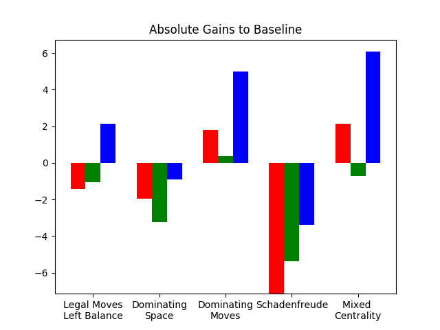

#Analysis of the Application of Heuristics to Evaluate Non-Terminal States in the Game of Isolation

## Choosing the Winning Move, Without Being Able to Look Ahead Indefinitely

To chose the best next move we consult a game search tree for a zero-sum game such
as Isolation.

The tree ultimately should be evaluated to reach terminal end states. Terminal
states can be accurately evaluated taking into account if they represent a win,
loss or draw.
From there it is an easy task to backup the win or loss up the tree, so that a
decision can be made to follow a path towards a win.   

However the search tree of even such a small game of Isolation becomes big
quickly; making it infeasible to search all possible moves.

As a consequence we restrict the search to a defined depth per move.
When reaching the defined maximum depth without reaching terminal nodes, we
do not know if this path would eventually to a win, loss or draw.
In lieu of this hard information we need to apply a heuristic that should
approximate the anticipated result.

For the remainder we will discuss some common characteristics and then some
specific scenarios and their relative differences.

## Common Characteristics

#### Partitions

The lectures talked about a game of Isolation that is based on the movement
patterns of the Queen in Chess.

However the actual game of Isolation that we are now supplying heuristics for is
based on the Knight Chess figure.

The difference is noteworthy, because it was mentioned the major factor to
lookout for was partitioning. However this is not really all that important
anymore as the Knight can jump over barriers and the movement patterns is less
linear than the Queen's.

As a consequence an evaluation function would need to burn a lot of CPU checking
individual moves of a Knight instead of just measuring reachable spaces by the
Queen.

Have a look at the Queen (Qu) in comparison to the Knight (Kn). They both start
from the blue position, can reach the dark green boxes with the first move and
the light green boxes with the second move:

{#id .class width=50% }
{#id .class width=50% }

From the starting positions depicted above the Queen could reach any box within
two moves. Whereby the Knight cannot dominate a comparable area as he is limited in its
reach.

However this explains why introducing a barrier[^1] has a much greater impact for
the Queen.

{#id .class width=50%  }
{#id .class width=50%  }

Without the barrier the Queen was able to reach 80 boxes within two moves after
the initial placement. After the partition is introduced the Queen loses 45
boxes (~56%). In the above diagram the loss is marked in grey.

Prior to introducing the partition the Knight was able to reach 28 boxes within
two moves. It is still able to do so after the introduction of the partition
as s/he can jump across any obstacles, as long as the target box is not
occupied.

_Taking a closer look it is more complicated, as the partition occupies boxes
itself too, but the overall pictures remains the same: A contiguous line of
previously occupied boxes forms a barrier that may partition the board for a
Queen. Not so for a Knight, as s/he can jump._

In conclusion, occupied boxes are relevant no matter what movement patterns,
but partitions do not form easily for Knights and therefore are not valuable
features to look for.

[^1]: The introduced partition is just symbolic. It is simplified in the way to
be in between boxes, but a true partition in the game would be built by prior
moves, so it would occupy the boxes.

#### Centrality

We saw that looking for partitions does not seem fruitful. Also, given the
movement pattern of a Knight, just counting blank spaces would not be all that
helpful.
This also implies that the importance of placing the initial move in the center
is limited as well.

However even a Knight can be boxed in. Without burning the extra CPU cycles to
map out all possible moves, it is still interesting to understand that the edges
of the board automatically limit the possible moves of the player.
Therefore - all other factors being equal - a more central position is
preferable.

This is only relevant for the move at hand, but not for the moves prior to that.
Furthermore "all other factors being equal" becomes less and less true over the
course of a game. So decaying the value of centrality seems like a good idea.

## Comparing Different Heuristics

In the following sections heuristics are described that were evaluated against
the provided ID_Improved scoring method. Agains this baseline relative strengths
are gathered.

The baseline evaluates the difference of legal moves left to the the two
players.

The results are expressed as absolute differences to the score of the baseline
evaluation method.

_With the default `NUM_MATCHES=5` in `tournament.py` the variance of the
results varied by test run in the same order of magnitude as the expected
changes. Using `NUM_MATCHES>10` resulted in an acceptable level of variance.
Also the relative differences to the baseline ID_Improved seemed more stable as
the absolute values.
The results are still very sensitive to other workloads running on the same
machine._

|Method              | \[ \Delta \] |
|------              |------   |
|Baseline            | ---     |
|Dominating Moves    | +2.4%  |
|Dominating Space| -2.0% |
|Schadenfreude| -5.3% |
|Mixed Centrality| 2.5% |
|Legal Moves Left (Canary) | -0.1%|

Gains were averaged over three runs with `NUM_MATCHES=20` and `TIME_LIMIT=500`,
everything else were left to the defaults.

### Dominating Moves

This heuristic is comparable to ID_Improved as it also takes into account the
balance of legal moves left for both players.

However it does not express the balance as difference, but a ratio of move of
the player itself vs all moves left (player's moves: \(M_p\) and opponent's
moves: \(M_o\)) and also gives more weight to the opponents moves.

The results are somewhat encouraging - beating ID_Improved consistently - and
for the future it would be interesting to experiment with the weights.

\(r = \left(\frac{M_p}{1+M_p+3M_o}\right)\)

### Dominating Space

Calculating the reward based on the relative dominance of the current
player with respect to the available space. Expressed as ratio.

Here the current players remaining moves are compared to remaining blank spaces
(\(B\)).
Strictly speaking this is an apples to oranges comparison, because not all
spaces may be reachable given the movement pattern - two moves in one direction
and one move in another - but this is just one of many heuristics and could be
enhanced by changing to a more exact method, when only five spaces are
remaining.

This method ignores the opponent's position. It could be extended to run
this for the opponent as well and then express it as a balance or ratio.

\(r = \left( \frac{M_p}{B} \right)\)

### Schadenfreude

Calculating the score by putting an emphasis on limiting the other player's
inability to move.

The current implementation is laser sharp focused on the opponent only.
A more balanced implementation could take the current players possible moves
into account as well.

\(r=-M_o\)

### Mixed Centrality

As described above partitions don't play a big role when the movement patterns
is that of a Knight. Nevertheless a central position is beneficial, more
specifically to stay away from the edges and corners. It reduced the chances of
being boxed in yourself and eating up the central space makes life harder for
the opponent.

Over time this becomes less relevant and also it becomes more likely for the
iterative deepening to come to the end.

To reflect this the value of this metric could be decayed with every move.
Doing this should be accompanied by cutting off calculating centrality at all,
to save CPU time for iterative deepening.

However in the initial testing the decay didn't seem to have much of an effect,
so that it is left out for now. Cutting out the centrality calculation after
five moves is still active.

\[ \Delta x^2 = \left(x-\frac{width}{2}\right)^2\]
\[ \Delta y^2 = \left(x-\frac{height}{2}\right)^2\]
\[ r=1-\left(\frac{\Delta x^2 * \Delta y^2}{width^2*height^2}\right)\]

In the diagram below the resulting advisable positions are marked in green,
and the positions to avoid in red.

{#id .class width=50%}

Playing with the weights and cutoffs could be interesting for the future.

### Legal Moves Left Balance

This is basically the same as the base line and should therefore be zero. It
shows that with the current setup the results are not fully reproducible.

## Summary

Possibilities are endless at the beginning.
Save our breath later on to run to the end instead.

# Data

[Run](repeated_run4.txt) <-- Link
